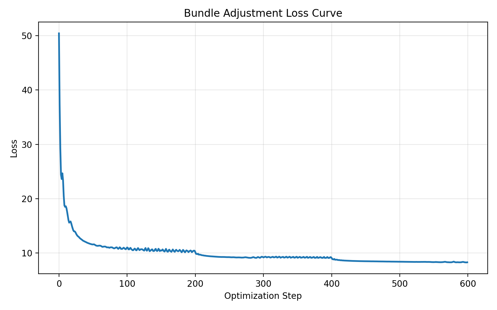
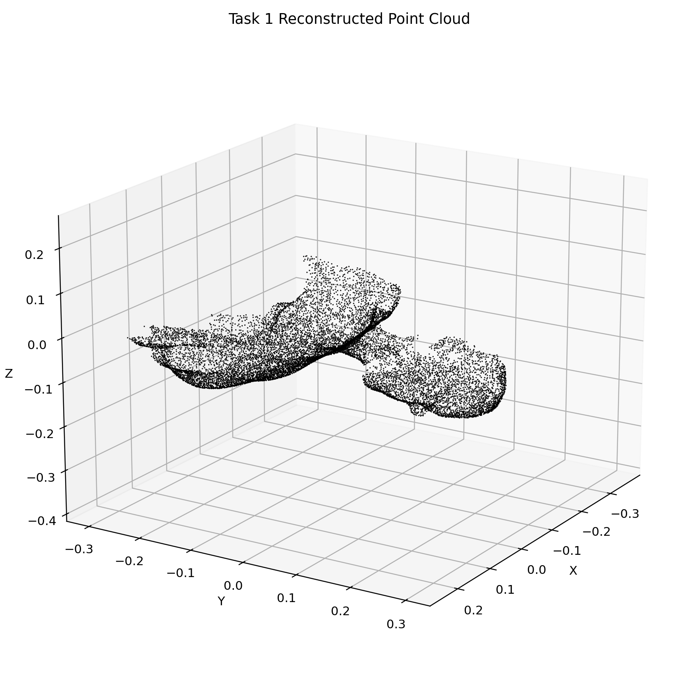
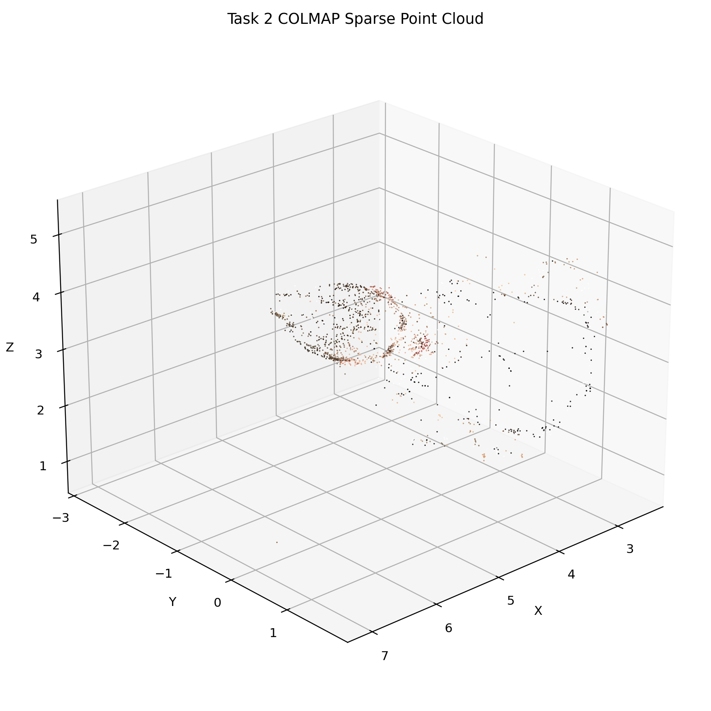

# DIP 作业仓库

## 仓库说明

- 课程名称：数字图像处理
- 学生：熊易
- 仓库用途：提交课程作业代码、实验结果与说明文档

## 环境配置

- Python 3.11
- 环境：Conda
- 主要依赖：
  - PyTorch
  - NumPy
  - Matplotlib
  - OpenCV
  - COLMAP

## 目录结构

- `01_ImageWarping/`：第一次作业
- `02_DIPwithPyTorch/`：第二次作业
- `03_BundleAdjustment/`：第三次作业

## 第三次作业：Bundle Adjustment

### 作业内容

第三次作业包含两个部分：

1. 使用 PyTorch 从零实现 Bundle Adjustment
2. 使用 COLMAP 对多视角图像进行三维重建

### 相关文件

- `03_BundleAdjustment/solve_bundle_adjustment.py`
- `03_BundleAdjustment/render_results.py`
- `03_BundleAdjustment/run_colmap.sh`
- `03_BundleAdjustment/visualize_data.py`
- `03_BundleAdjustment/data/points2d.npz`
- `03_BundleAdjustment/data/points3d_colors.npy`

## 第一部分：Bundle Adjustment

### 任务目标

根据 50 个视角下的 2D 观测，优化恢复以下变量：

- 共享焦距 `f`
- 每个视角的相机旋转与平移
- 20000 个 3D 点坐标

### 实现内容

我新增了 `solve_bundle_adjustment.py`，完成了以下内容：

- 使用 Euler 角参数化每个相机的旋转
- 使用老师给出的投影公式进行 3D 到 2D 的投影
- 仅在 `visibility = 1` 的位置计算重投影误差
- 使用 Adam 联合优化焦距、相机外参和 3D 点坐标
- 输出优化结果、loss 曲线和带颜色的 OBJ 点云

### 运行方式

```bash
cd /home/xiongyi/DIP-homework/03_BundleAdjustment
python3 solve_bundle_adjustment.py
```

本次实际运行命令为：

```bash
python3 solve_bundle_adjustment.py --steps 600 --log-every 50 --output-dir outputs/task1_final --cpu
```

### 实验结果

本机在 CPU 上完成了 600 步优化，最终结果为：

- device：`cpu`
- steps：`600`
- final focal：`3021.243896`
- final reprojection error：`8.339454`

生成的输出文件位于：

- `03_BundleAdjustment/outputs/task1_final/loss_curve.png`
- `03_BundleAdjustment/outputs/task1_final/reconstructed_points.obj`
- `03_BundleAdjustment/outputs/task1_final/bundle_adjustment_result.npz`
- `03_BundleAdjustment/outputs/task1_final/summary.txt`
- `03_BundleAdjustment/outputs/rendered_results/task1_point_cloud.png`

损失曲线如下：



重建点云渲染结果如下：



### 结果分析

- loss 在前 50 步下降较快，从约 `50.41` 降到 `11.59`
- 继续优化后，平均重投影误差下降到约 `8.34` 像素
- 焦距从初始化值附近逐渐增大到约 `3021`
- 当前结果已经能够输出完整点云和优化曲线，说明 Bundle Adjustment 的基本优化流程是正确的

## 第二部分：COLMAP 三维重建

### 任务目标

按照老师提供的 `run_colmap.sh`，完成以下流程：

1. 特征提取
2. 特征匹配
3. 稀疏重建
4. 图像去畸变
5. Patch Match Stereo
6. Stereo Fusion

### 实现内容

我直接使用老师提供的 `run_colmap.sh` 执行 COLMAP 重建流程，并额外导出了稀疏点云的 `PLY` 文件，方便后续查看结果。

### 运行方式

```bash
cd /home/xiongyi/DIP-homework/03_BundleAdjustment
bash run_colmap.sh
```

### 实验结果

本机已经成功完成以下步骤：

1. 特征提取
2. 特征匹配
3. 稀疏重建
4. 图像去畸变

实际得到的稀疏重建结果为：

- 重建图像数：`50`
- 稀疏点数：`1699`

输出目录位于：

- `03_BundleAdjustment/data/colmap/database.db`
- `03_BundleAdjustment/data/colmap/sparse/0/`
- `03_BundleAdjustment/data/colmap/dense/`
- `03_BundleAdjustment/data/colmap/sparse/0/sparse_points.ply`
- `03_BundleAdjustment/outputs/rendered_results/task2_sparse_point_cloud.png`

COLMAP 稀疏点云渲染结果如下：



### 结果分析

- 稀疏重建部分已经完整跑通，说明这组多视角图像可以被 COLMAP 正常匹配和建图
- 去畸变阶段也已完成，后续可以直接衔接稠密重建
- 当前安装的 `COLMAP 3.7` 是不带 CUDA 的版本，因此在 `patch_match_stereo` 阶段报错，导致稠密重建未能继续完成
- 因此目前 Task 2 已完成到稀疏重建和去畸变阶段，但稠密重建仍依赖带 CUDA 支持的 COLMAP 版本

### 局限性

- Task 1 当前是在 CPU 上完成优化，速度明显慢于 GPU
- Task 1 的最终误差还有继续下降空间，后续可以通过更长的优化步数或更好的初始化继续改进
- Task 2 的稠密重建没有完成，主要原因是当前安装的 COLMAP 不带 CUDA 支持，而不是数据或脚本本身有问题

## 参考文献

- Bundle Adjustment — Wikipedia
- PyTorch Optimization Documentation
- COLMAP Documentation

## 附：结果渲染脚本

如果需要重新生成报告中的点云渲染图，可以运行：

```bash
cd /home/xiongyi/DIP-homework/03_BundleAdjustment
python3 render_results.py
```
