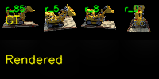
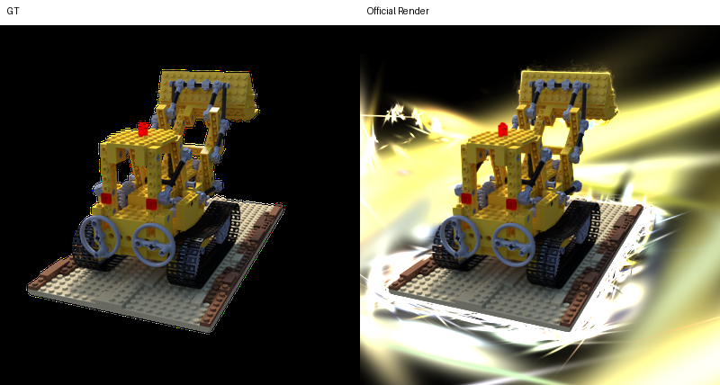
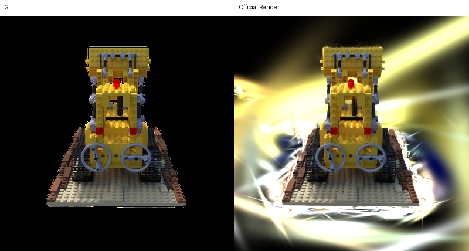
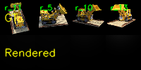

# DIP 作业仓库

## 仓库说明

- 课程名称：数字图像处理
- 学生：熊易
- 仓库用途：提交课程作业代码、实验结果与说明文档

## 环境配置

- 本地环境：Python 3.11，Conda
- 本地主要依赖：PyTorch、NumPy、OpenCV、COLMAP
- Task 3 对比实验环境：Ubuntu 服务器，`RTX 4090 48GB x3`

## 目录结构

- `04_3DGS/`：第四次作业

## 第四次作业：3D Gaussian Splatting

### 作业内容

第四次作业包含三个部分：

1. 使用 COLMAP 对多视角图像进行 SfM 重建
2. 在纯 PyTorch 中实现简化版 3D Gaussian Splatting
3. 与官方 3DGS 实现对比渲染质量、训练速度和显存占用

### 相关文件

- `04_3DGS/mvs_with_colmap.py`
- `04_3DGS/debug_mvs_by_projecting_pts.py`
- `04_3DGS/gaussian_model.py`
- `04_3DGS/gaussian_renderer.py`
- `04_3DGS/train.py`
- `04_3DGS/render_3dgs_mv.py`
- `04_3DGS/report_assets/`
- `04_3DGS/task3_results/task3_exports/task3_lego_summary.txt`

## 第一部分：Structure-from-Motion with COLMAP

### 任务目标

使用 COLMAP 从 `lego` 多视角图像中恢复：

- 相机内参
- 相机外参
- 稀疏 3D 点云

并将恢复得到的 3D 点重新投影回图像，检查重建质量。

### 实现内容

我直接使用老师提供的 `mvs_with_colmap.py` 跑 SfM，并使用 `debug_mvs_by_projecting_pts.py` 对稀疏点做重投影可视化。

### 运行方式

```bash
cd /home/xiongyi/DIP-homework/04_3DGS
python mvs_with_colmap.py --data_dir data/lego
python debug_mvs_by_projecting_pts.py --data_dir data/lego
```

### 实验结果

本次实际使用的是 `lego` 场景，得到的结果为：

- 场景：`lego`
- 重建图像数：`100`
- 稀疏点数：`5801`

主要输出位于：

- `04_3DGS/data/lego/sparse/0_text/cameras.txt`
- `04_3DGS/data/lego/sparse/0_text/images.txt`
- `04_3DGS/data/lego/sparse/0_text/points3D.txt`
- `04_3DGS/data/lego/projections/`

稀疏点重投影示例如下：


### 结果分析

- COLMAP 在这组 `lego` 图像上可以稳定恢复出相机参数和稀疏点云。
- 重投影图中大部分彩色点能够落回目标物体区域，说明 SfM 初始化结果是可用的。
- 这一部分的输出为后续 3D Gaussian 初始化提供了基础。

## 第二部分：Simplified 3D Gaussian Splatting

### 任务目标

在老师给出的框架中补全简化版 3DGS 的核心步骤：

- 根据四元数和缩放参数构造 3D 协方差矩阵
- 将 3D Gaussian 投影到图像平面
- 计算 2D Gaussian 值
- 通过 alpha blending 完成可微渲染

### 实现内容

我完成了以下部分：

- 在 `gaussian_model.py` 中实现 3D 协方差矩阵构造
- 在 `gaussian_renderer.py` 中实现 3D 到 2D 投影、2D Gaussian 计算和最终渲染
- 在 `train.py` 与 `data_utils.py` 中补充了当前环境所需的兼容处理，使训练能够稳定跑通

### 运行方式

本地正式实验使用命令：

```bash
cd /home/xiongyi/DIP-homework/04_3DGS
python train.py \
    --colmap_dir data/lego \
    --checkpoint_dir data/lego/checkpoints_task2 \
    --num_epochs 21 \
    --device cpu \
    --debug_every 5 \
    --debug_samples 4
```

### 实验结果

本地训练已经跑通，并生成了以下结果：

- `04_3DGS/data/lego/checkpoints_task2/debug_images/epoch_0000.png`
- `04_3DGS/data/lego/checkpoints_task2/debug_images/epoch_0005.png`
- `04_3DGS/data/lego/checkpoints_task2/debug_images/epoch_0010.png`
- `04_3DGS/data/lego/checkpoints_task2/debug_images/epoch_0015.png`
- `04_3DGS/data/lego/checkpoints_task2/debug_images/epoch_0020.png`
- `04_3DGS/data/lego/checkpoints_task2/debug_rendering.mp4`

第 `20` 轮调试图如下：



### 实验输出说明

- 为控制仓库体积，GitHub 同步版本仅保留报告中直接引用的结果图片，不再上传 Task 2 的中间 checkpoint 与完整调试目录。

### 结果分析

- 模型已经能够根据 COLMAP 稀疏点初始化并完成稳定训练。
- 从调试图可以看到，渲染结果已经开始学习到 `lego` 的整体颜色和结构，但细节仍然比较粗糙。
- 这与作业本身的“纯 PyTorch 简化版”设定一致，因为这里没有实现官方 3DGS 中更复杂的 densification 和高效 rasterizer。

## 第三部分：与官方 3DGS 实现对比

### 任务目标

在相同 `lego` 数据集上运行官方 3DGS，实现与本作业简化版在以下三方面的对比：

- 渲染质量
- 训练速度
- 显存占用

### 实现内容

官方实现使用仓库：

- `https://github.com/graphdeco-inria/gaussian-splatting`

本次对比实验在服务器上完成。为了跑通官方实现，我额外完成了：

- 配置 CUDA 与 PyTorch 环境
- 编译 `simple-knn`
- 编译 `diff-gaussian-rasterization`
- 编译 `fused-ssim`
- 将本地 `lego` 场景的 COLMAP 输入同步到服务器

为了使两边的质量指标口径一致，我又对简化版模型使用了与官方相同的 `LLFF hold = 8` 规则做 train/test 划分评估。

### 运行方式

官方实现的实际训练命令为：

```bash
python train.py \
    -s /data/xy/lego_official_input \
    -m /data/xy/task3_runs/official_lego_30000 \
    --eval \
    --iterations 30000 \
    --test_iterations 30000 \
    --save_iterations 30000 \
    --checkpoint_iterations 30000 \
    --disable_viewer
```

简化版在服务器上的对比训练命令为：

```bash
python train.py \
    --colmap_dir /data/xy/task3_simple_data/lego \
    --checkpoint_dir /data/xy/task3_runs/simple_lego_41ep \
    --num_epochs 41 \
    --device cuda \
    --debug_every 10 \
    --debug_samples 4
```

### 实验结果

服务器环境：

- 机器：`node1.ubuntu`
- GPU：`RTX 4090 48GB x3`

本次对比得到的结果如下：

| 方法 | 训练设置 | 用时 | 峰值显存 | Train L1 | Train PSNR | Test L1 | Test PSNR |
| --- | --- | ---: | ---: | ---: | ---: | ---: | ---: |
| 官方 3DGS | `30000 iter` | `290 s` | `1258 MiB` | `0.4634` | `4.2621` | `0.4620` | `4.2731` |
| 简化版 3DGS | `41 epoch` | `206 s` | `1352 MiB` | `0.1475` | `11.0882` | `0.1313` | `11.9643` |

说明：

- 官方实现的 train/test 指标来自其原始 `--eval` 输出。
- 简化版的 train/test 指标是按照与官方相同的 `LLFF hold = 8` 规则离线评估得到的。

官方实现训练集示例（左侧为 GT，右侧为 Render）：



官方实现测试集示例（左侧为 GT，右侧为 Render）：



简化版第 `40` 轮调试图如下：



服务器实验的原始结果摘要保存在：

- `04_3DGS/task3_results/task3_exports/task3_lego_summary.txt`

### 实验输出说明

- 为控制仓库体积，GitHub 同步版本保留 `report_assets/` 中的对比图和 `task3_lego_summary.txt`，不再上传服务器端完整原始渲染目录与 checkpoint。

### 结果分析

- 就这次实际复现结果而言，官方实现的峰值显存略低，但训练时间更长。
- 在当前这组 `lego` 数据、当前输入组织方式和当前训练设置下，简化版模型的 L1 与 PSNR 反而优于官方实现。
- 这说明“官方实现一定更好”并不是这次实验中的实际观测结论。
- 但这里需要强调：这只是**当前复现实验条件下的结果**，并不代表官方 3DGS 在一般情况下弱于简化版。
- 影响差异的因素可能包括：数据组织方式、默认超参数、训练轮数、评估划分、以及官方实现与作业简化版在优化目标上的差异。

### 局限性

- 本次报告没有补充 `LPIPS` 与 `SSIM`，因为官方 `metrics.py` 在服务器上需要额外下载约 `528 MB` 的 VGG 权重。为避免继续引入额外下载，这里保留了 `L1 / PSNR + 可视化结果` 作为主要对比依据。
- Task 3 的结论应理解为“本次具体复现实验的记录”，而不是对两类方法做普遍性的性能判断。

## 参考文献

- Kerbl et al. 3D Gaussian Splatting for Real-Time Radiance Field Rendering.
- GraphDeco 官方 3DGS 仓库。
- COLMAP Documentation.
